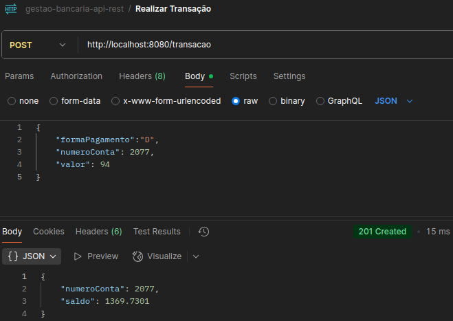
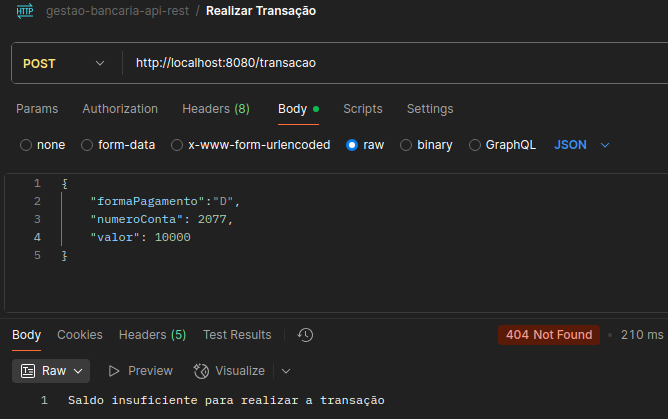
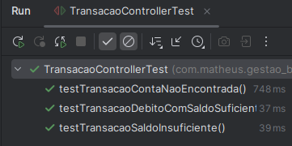

# gestao-bancaria-api-rest

## Endpoint Conta

### Criar a Rota "/conta" no Postman


### Criar a Classe ContaController
- Utilizada para definir a rota e os métodos HTTP

### Criar o Record DadosConta (DTO)
- Data Transfer Object
- Usado para transferir dados entre partes da aplicação
- Caso a conta possuísse mais campos e o usuário só precisasse de alguns desses dados retornados, uma DTO seria utilizada
- Exemplo: Classe Conta possui 3 atributos, mas um dos atributos não deve ser exposto, então ao invés de retornar a class Conta, é criada uma DTO e definida somente os dois campos dentro dela

```java
@Entity
public class Conta {
    @Id
    private Integer id;

    private float saldo;

    private String chavePix; // não quer expor
}

public record ContaDTO(Integer id, float saldo) {}
```

### Criação da Classe Conta (Entidade JPA)
- Classe que mapeia uma tabela
- A classe representa uma linha na tabela
- Cada campo representa uma coluna

### Criação da Interface Repositório
- Interface para acessar e manipular uma entidade JPA

### Criação do Database
- MYSQL no terminal: mysql -u root -p


### Criação da Migration de criação da tabela
- A utilização de Migrations é feita para registrar as atualizações no banco de dados
- Para cada mudança que quisermos executar no banco, precisamos criar um arquivo ```.sql``` no projeto e escrever a 
  query que será executada
- O arquivo deve ser salvo em um diretório específico: ```db/migration```
- O nome do arquivo sempre deve começar com Vn__, com n seguindo a ordem dos scripts
- Após a execução do script ```V1__create-table-conta.sql```, a tabela foi criada no sistema


- Ao executar o método POST no Postman, tem-se:


### Criação do método GET
- Foi criado o método GET fazendo com que seja impossível retornar todas as contas, por motivos de segurança.
- Ao utilizar o parâmetro "numero_conta" com um valor existente, obtém-se o seguinte resultado:


- Ao utilizar o parâmetro "numero_conta" com um valor não existente, obtém-se o seguinte resultado:


- Ao não utilizar o parâmetro "numero_conta", obtém-se o seguinte resultado:


## Endpoint Transacao

### Criar a Rota "/transacao" no Postman


``IMPORTANTE``: <b>O parâmetro "numero_conta" foi modificado para "numeroConta".<b>

### Criação da Entidade JPA Transação, DTO Record e Controller

### Realização da Lógica de Taxas
- Saldo Antes PIX


- Transação PIX


- Saldo Após PIX


- Transação Crédito


- Saldo Após Crédito


- Saldo Antes Débito


- Transação Débito


- Saldo Após Débito


- Saldo Insuficiente



## Testes Automatizados

- Foram testadas a ContaRepository e o TransacaoController
- Utilizado o MockMvc para simular requisições HTTP nos controllers
- Utilizado o DataJpaTest para testar os repositories com um banco de dados

### Testes do Repository

- Foram testadas a busca da conta pelo ID (numeroConta) e o salvamento da conta


### Testes do Controller

- Foram testadas transações com uma conta não existente, uma transação débito com saldo suficiente e uma transação 
  com saldo insuficiente



